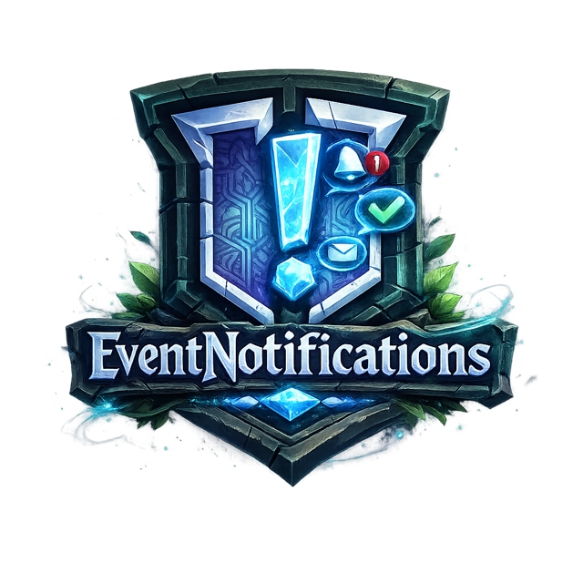

<p align="center">
  
</p>

<p align="center">
  <a href="https://github.com/jeppestaerk/Hytale-Plugin-Valhal-EventNotifications/releases/latest"></a>
  <a href="https://github.com/jeppestaerk/Hytale-Plugin-Valhal-EventNotifications/blob/main/LICENSE"></a>
  <a href="https://github.com/jeppestaerk/Hytale-Plugin-Valhal-EventNotifications/actions/workflows/build.yml"></a>
</p>

# Hytale EventNotifications Plugin

A Hytale server plugin that sends real-time notifications to external services when server events occur. Get notified via ntfy (phone, desktop, or web), Discord, Slack, or custom webhooks when players join, the server starts/stops, and more.

## Supported Notification Services

- **ntfy** - Free, open-source push notifications (recommended)
- **Discord** - Webhook notifications with rich embeds
- **Slack** - Webhook notifications with attachments
- **Webhooks** - Generic HTTP webhooks for custom integrations

## Installation

1. Download the latest `EventNotifications.jar` from releases
2. Place the JAR in your Hytale server's `mods` folder
3. Start the server once to generate the default config
4. Edit `config.json` to configure your notification targets
5. Restart the server

## Quick Start (ntfy)

The fastest way to get notifications:

1. Get [ntfy](https://ntfy.sh): install the mobile app, desktop app, or use the [web app](https://ntfy.sh/app)
2. In the app, subscribe to a topic (e.g., `my-hytale-server`)
3. In `config.json`, set `"enabled": true` at the top level
4. Set the ntfy target to `"enabled": true` and update the URL to `https://ntfy.sh/my-hytale-server`
5. Restart the server - you'll now receive notifications!

## Configuration

The config file is located at `mods/Valhal_EventNotifications/config.json`.

**Important:** The top-level `"enabled"` must be set to `true` for the plugin to send any notifications. By default, this is `false`.

For a complete example with all options, see [example-config.json](example-config.json).

### Basic Structure

```json
{
  "enabled": true,
  "targets": {
    "ntfy": { ... },
    "discord": { ... },
    "slack": { ... },
    "webhook": { ... }
  }
}
```

### ntfy Setup

[ntfy](https://ntfy.sh) is a free push notification service. You can use the public server or self-host.

```json
"ntfy": {
  "type": "ntfy",
  "enabled": true,
  "url": "https://ntfy.sh/your-topic-name",
  "events": {
    "serverStart": {
      "enabled": true,
      "title": "{server} - Online",
      "message": "The server is now online!",
      "priority": "high",
      "tags": "green_circle"
    }
  }
}
```

### Discord Setup

1. Create a webhook in your Discord channel (Channel Settings > Integrations > Webhooks)
2. Copy the webhook URL

```json
"discord": {
  "type": "discord",
  "enabled": true,
  "url": "https://discord.com/api/webhooks/YOUR_ID/YOUR_TOKEN",
  "discordUsername": "Hytale Server",
  "discordUseEmbeds": true,
  "events": {
    "playerJoin": {
      "enabled": true,
      "title": "Player Joined",
      "message": "**{player}** joined the server",
      "color": "#5865F2"
    }
  }
}
```

### Slack Setup

1. Create a Slack app at [api.slack.com/apps](https://api.slack.com/apps)
2. Enable "Incoming Webhooks" and create a webhook for your channel
3. Copy the webhook URL

```json
"slack": {
  "type": "slack",
  "enabled": true,
  "url": "https://hooks.slack.com/services/YOUR/WEBHOOK/URL",
  "slackUseAttachments": true,
  "events": {
    "playerJoin": {
      "enabled": true,
      "title": "Player Joined",
      "message": "*{player}* joined the server",
      "color": "#5865F2"
    }
  }
}
```

### Webhook Setup

For custom integrations with any HTTP endpoint:

```json
"webhook": {
  "type": "webhook",
  "enabled": true,
  "url": "https://your-server.com/webhook",
  "contentType": "application/json",
  "events": {
    "serverStart": {
      "enabled": true,
      "title": "Server Online",
      "message": "The server started"
    }
  }
}
```

## Authentication

All targets support optional authentication. Add these fields to any target configuration.

### Bearer Token

For services that use token-based auth (like ntfy with access tokens (optional)):

```json
"bearerToken": "tk_your_token_here"
```

This sends an `Authorization: Bearer tk_your_token_here` header with each request.

### Basic Auth

For services that use username/password authentication:

```json
"username": "your_username",
"password": "your_password"
```

This sends an `Authorization: Basic <base64>` header with each request.

### Custom Headers

For webhooks that need custom authentication headers:

```json
"headers": {
  "X-API-Key": "your-api-key",
  "X-Custom-Header": "value"
}
```

## Supported Events

| Event | Placeholders | Description |
|-------|--------------|-------------|
| `serverStart` | `{server}` | Server finished starting |
| `serverStop` | `{server}` | Server is shutting down |
| `playerJoin` | `{server}`, `{player}` | Player connected |
| `playerLeave` | `{server}`, `{player}` | Player disconnected |
| `playerChat` | `{server}`, `{player}`, `{message}` | Player sent a chat message (disabled by default) |
| `gameModeChange` | `{server}`, `{gamemode}` | Game mode changed |
| `groupPermissionChange` | `{server}`, `{group}`, `{action}`, `{permissions}` | Group permissions modified |
| `playerPermissionChange` | `{server}`, `{player}`, `{action}`, `{group}`, `{permissions}` | Player permissions modified |

**Note:** Chat notifications are disabled by default to avoid notification spam on busy servers. Enable `playerChat` in your config if you want to receive chat messages.

## Event Configuration Options

Each event supports these options:

| Option | Description |
|--------|-------------|
| `enabled` | Whether to send notifications for this event |
| `title` | Notification title (supports placeholders) |
| `message` | Notification body (supports placeholders) |
| `priority` | ntfy priority: `min`, `low`, `default`, `high`, `urgent` |
| `tags` | ntfy emoji tags (e.g., `green_circle`, `skull`) |
| `color` | Discord/Slack color as hex (e.g., `#5865F2`) |

## Target Configuration Options

### ntfy Options

| Option | Default | Description |
|--------|---------|-------------|
| `ntfyMarkdown` | `true` | Enable markdown formatting in messages |
| `ntfyDefaultPriority` | `default` | Default priority for all events (`min`, `low`, `default`, `high`, `urgent`) |
| `ntfyIcon` | - | URL to icon image shown in notifications |

### Discord Options

| Option | Default | Description |
|--------|---------|-------------|
| `discordUsername` | `{server}` | Bot username shown in Discord (defaults to server name) |
| `discordAvatarUrl` | - | URL to bot avatar image |
| `discordUseEmbeds` | `true` | Use rich embeds instead of plain messages |

### Slack Options

| Option | Default | Description |
|--------|---------|-------------|
| `slackUsername` | `{server}` | Bot username shown in Slack (defaults to server name) |
| `slackIconUrl` | - | URL to bot icon image |
| `slackIconEmoji` | - | Emoji to use as bot icon (e.g., `:video_game:`) |
| `slackUseAttachments` | `true` | Use rich attachments instead of plain messages |

### Webhook Options

| Option | Default | Description |
|--------|---------|-------------|
| `contentType` | `application/json` | HTTP Content-Type header |
| `bodyTemplate` | - | Custom body template (see below) |
| `headers` | - | Custom HTTP headers as key-value pairs |

#### Custom Body Template

Use `bodyTemplate` to send a custom JSON payload instead of the default format:

```json
"webhook": {
  "type": "webhook",
  "enabled": true,
  "url": "https://your-server.com/webhook",
  "bodyTemplate": "{\"event\": \"{eventType}\", \"text\": \"{message:json}\"}",
  "events": { ... }
}
```

Available template placeholders: `{eventType}`, `{title}`, `{message}`, `{priority}`, `{tags}`, plus all event-specific placeholders. Use `:json` suffix for JSON-escaped values (e.g., `{message:json}`).

## Multiple Targets

You can enable multiple targets simultaneously. Each target has independent event settings, so you can send different events to different services:

```json
{
  "targets": {
    "ntfy": {
      "enabled": true,
      "events": {
        "serverStart": { "enabled": true },
        "playerChat": { "enabled": false }
      }
    },
    "discord": {
      "enabled": true,
      "events": {
        "serverStart": { "enabled": true },
        "playerChat": { "enabled": true }
      }
    }
  }
}
```

## Troubleshooting

**Notifications not sending?**
- Check that the target is `enabled: true`
- Verify the event is `enabled: true` within that target
- Ensure the URL is correct and accessible from your server
- Check server logs for error messages

**Discord embeds not showing?**
- Make sure `discordUseEmbeds` is `true`
- Verify webhook URL is complete and valid

## Acknowledgments

This project was built using [Hytale-Example-Project](https://github.com/Build-9/Hytale-Example-Project) as a template.

## License

MIT License
